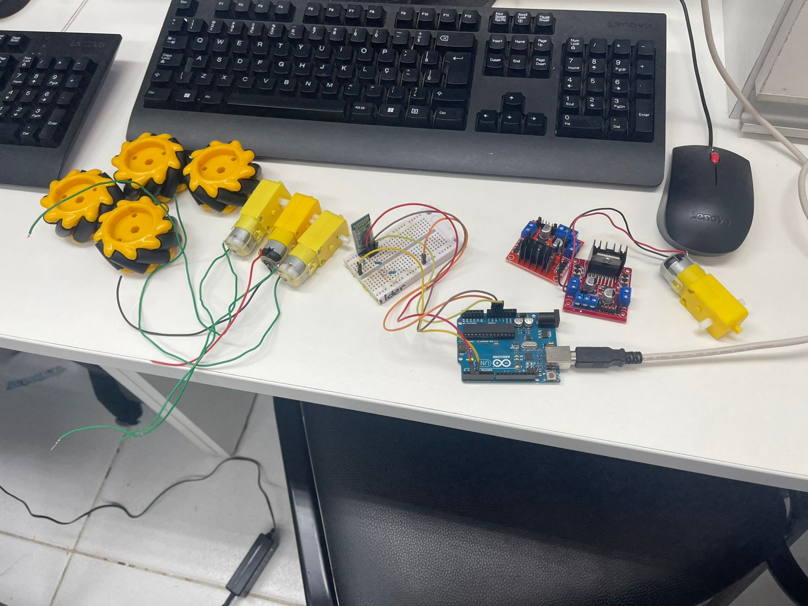
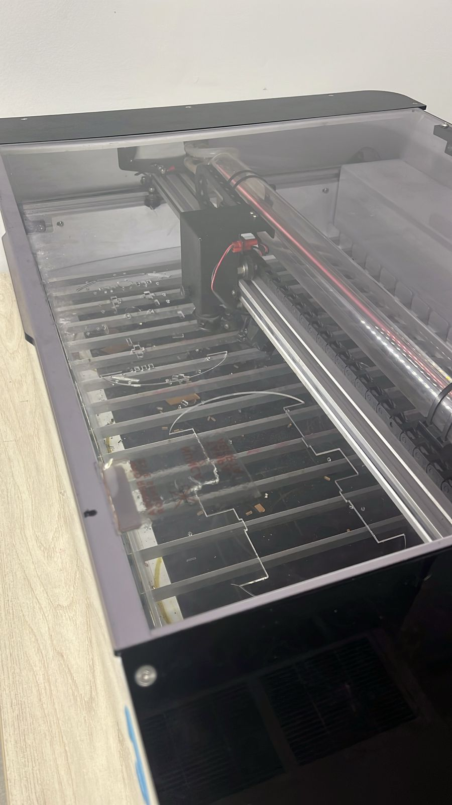
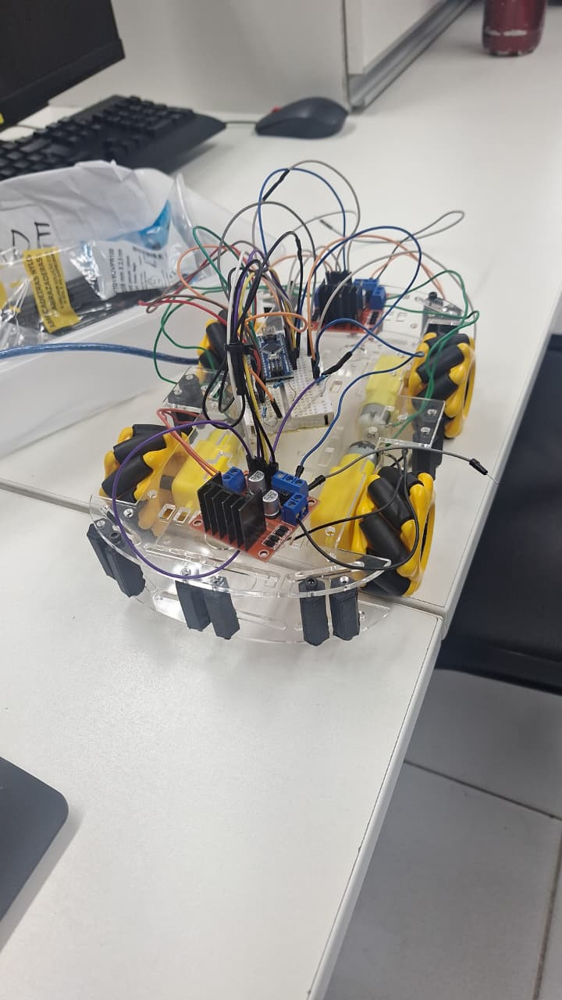
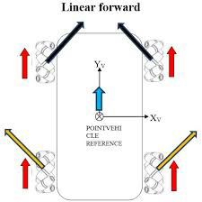
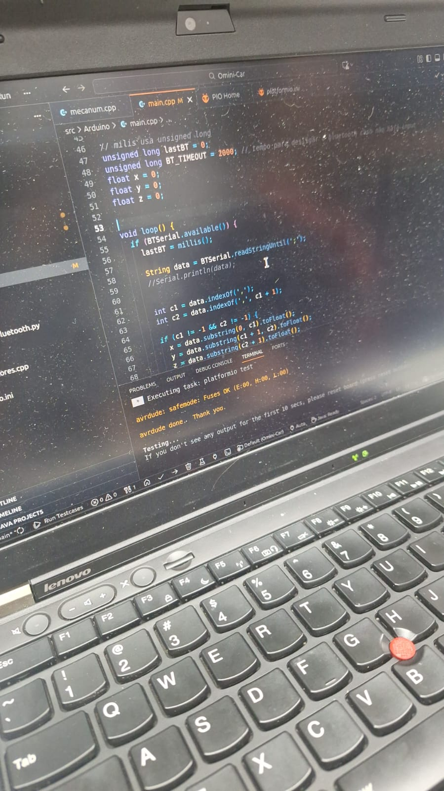
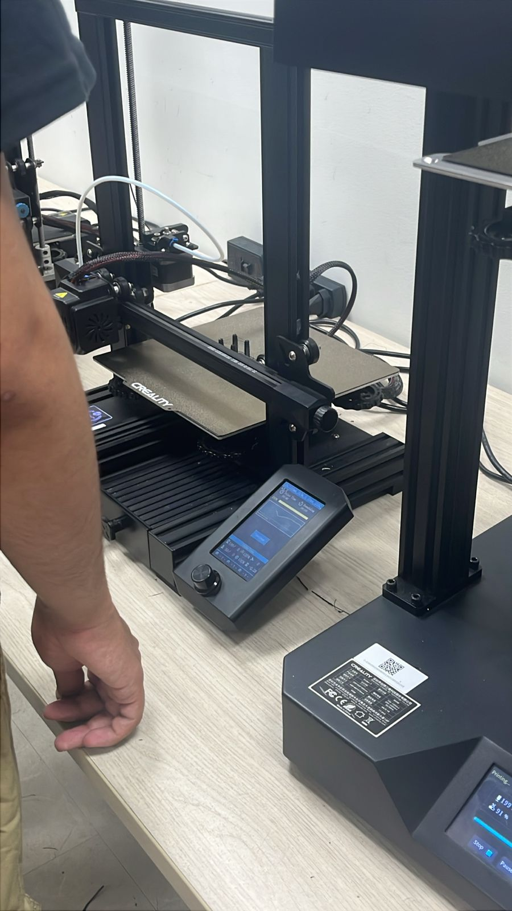
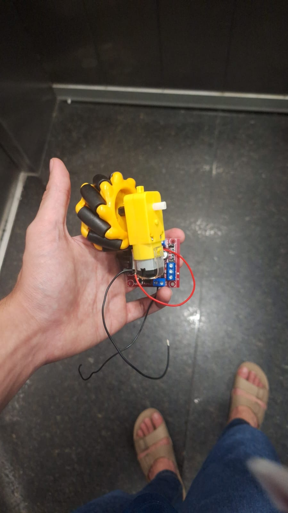

# Omini-Car
Omini-Car é um carrinho Bluetooth omnidirecional capaz de se mover em qualquer direção (frente, trás, deslizar para esquerda/direita e rotação) sem alterar sua orientação. Essa capacidade é alcançada utilizando rodas Mecanum e 4 motores independentes, controlados por um controle de videogame via Bluetooth.

O firmware do Arduino é construído usando PlatformIO (C++), e é usado um código em Python usando as bibliotecas pygame e pyserial para fazer a conexão: Controle -> PC - > Arduino.

<video src="media/video1.mp4" video1></video>
<video src="media/video2.mp4" video2></video>

## Equipe
 Almério Jakcson\
 Arthur Duque\
 João Azevedo\
 Matheus Alcântara\
 Vinícius Baumel

# Materiais usados
- 1x Arduino Nano
- 1x Protoboard
- 4x Rodas mecanum de 60mm
- 4x Motores DC 3-6V
- 8x Fios para os motores
- 2x Pontes H 298N
- 1x Módulo Bluetooth HC-05
- 2x [Chassis de acrílico](https://www.printables.com/model/186945-4wd-buggy-chassis-arduino)
- 16x Espaçadores de 3cm (feitos em impressora 3D)
- 32x Parafusos de 3mm
- 22x Jumpers
- 3x Resistores de 1K
- 1x Bateria 11.3V (recomendável uma de maior voltagem)
- 1x Controle de video game (com pelo menos 2 joysticks)
- 1x Computador com Bluetooth

# Apresentação do projeto:
Apresentação final para a caderia de Introdução a Computação

## Processos de criação:
### Bluetooth:
Optamos por utilizar a comunicação Bluetooth para controlar o carrinho, utilizando o módulo HC-05. Para ajustar a tensão para 3,3V, foi necessário o uso de resistores em um dos pinos do módulo. Como diferencial, integramos um controle de videogame, estabelecendo a comunicação controle → PC → Arduino. Isso foi viabilizado por um código em Python utilizando a biblioteca Pygame para realizar a comunicação entre o controle e o Arduino.\


### Design / Modelo do Carrinho:
Inicialmente, realizamos uma pesquisa para definir o design do chassi e do suporte. Após essa definição, verificamos que o modelo com Arduino Uno seria grande demais, por isso substituímos por um Arduino Nano. A seguir, cortamos o acrílico e fizemos as impressões 3D dos componentes no espaço maker. Realizamos o encaixe com parafusos e, finalmente, montamos o suporte completo do carrinho.\



### Motores:
Iniciamos a montagem das conexões da ponte H com os motores, utilizando uma fonte de alimentação para testar cada motor individualmente. Cada motor foi acoplado a uma roda mecanum omnidirecional, permitindo a movimentação do carrinho em todas as direções (como descrito no relatório inicial), utilizando os vetores dos eixos X e Y.\



## Dificuldades: 
### Bluetooth:
A maior dificuldade foi implementar a biblioteca de Bluetooth no código, especialmente no que se refere às conexões entre o computador e o Arduino, além de enviar os inputs do controle para o Arduino. Também enfrentamos dificuldades para manter a conexão estável por longos períodos. Outro desafio foi o ajuste da voltagem nos fios para garantir uma comunicação eficiente.


### Design / Modelo do Carrinho:
A principal dificuldade foi ajustar as proporções do modelo, pois as informações encontradas na internet eram inconsistentes. Durante o corte do acrílico, uma das peças do chassi quebrou. As impressões 3D também apresentaram falhas, principalmente nas peças do chassi e para-choque, que não tinham boa qualidade e se desmanchavam facilmente. Por conta da falta de tempo, optamos por simplificar a impressão, fazendo um modelo apenas para o suporte, sem o para-choque.


### Motores:
O ajuste de voltagem para os motores foi outro desafio, pois precisávamos garantir que todos os componentes funcionassem corretamente. A ligação da ponte H também apresentou dificuldades, especialmente em relação à polaridade e ao uso do pino enable para controlar a ativação dos motores. Além disso, tivemos problemas para sincronizar os motores, o que exigiu ajustes no código para garantir que os motores operassem de forma coordenada e eficiente.


## Considerações Finais sobre o Projeto:
O desenvolvimento deste projeto permitiu aplicar conhecimentos teóricos de mecânica, eletrônica e programação. Embora tenhamos enfrentado dificuldades, como as inconsistências nos modelos, falhas nas impressões 3D e limitações de tempo, conseguimos adaptar as soluções e concluir o carrinho funcional.
O uso do Bluetooth, o controle via controle de videogame e as rodas mecanum omnidirecionais trouxeram um diferencial importante ao projeto, permitindo movimentação em todas as direções. O trabalho em equipe foi crucial para o sucesso, assim como a resolução de problemas ao longo do processo.
Este projeto proporcionou um aprendizado prático significativo, demonstrando a importância do planejamento, adaptação e criatividade na execução de projetos tecnológicos.


# Setup no computador

## Pré-requisitos

Antes de executar, você precisa ter:
- Git
- Visual Studio Code 
- PlatformIO IDE (extensão do VS Code)
- Python
- pygame (biblioteca do python)
- pyserial (biblioteca do python)

**Obervação:** Esse projeto foi testado apenas em Linux. (Mint)
## Instalação

Clone o repositório:

```bash
git clone https://github.com/v-baumel/Omini-Car.git
cd Omini-Car
```

Abra a pasta no Visual Studio Code.

Instale a extensão PlatformIO IDE.

**Compilar o projeto:**

Clique no botão de Build na interface do PlatformIO ou execute:
```bash
pio run
```

**Enviar para o microcontrolador:**
Conecte sua placa via USB e clique no botão de Upload na interface do PlatformIO ou execute:
```bash
pio run --target upload
```

**Monitor serial (opcional):**
Para abrir o monitor serial e ver saídas do microcontrolador (via USB), clique no botão de Serial Monitor na interface do PlatformIO ou execute:
```bash
pio device monitor
```

Instale o Python (se ainda não tiver)

Instale o pygame executando:
```bash
python -m pip install pygame-ce
```

Instale o pyserial executando:
```bash
python -m pip install pyserial
```

## Conectando o Bluetooth
Certifique-se de que o modulo bluetooth está piscando rapidamente, isso significa que ele está esperando para parear. Então conecte-se a ele procurando por algo com nome HC-05, o pin é 1234. 

Feito isso, descubra a qual port o módulo está conectado (no linux geralmente é  /dev/rfcomm0 ou /dev/rfcomm1), vá em ./src/Computador/controller_bluetooth.py e na linha 11 bote a variável port para o nome do seu port e salve. (Não foi implementado um método automático de procurar o port)

Agora, conecte o seu controle ao computador(pode ser por bluetooth ou não), e rode esse mesmo código. Você vai ver no terminal os inputs enviados pelo controle, e no serial monitor, você poderá ver a força que o Arduíno bota em cada motor.

# Conexões dos jumpers dos motores 


**Ponte H frontal:**

Para o motor frontal esquerdo:  ENA=D3, IN1=D2, IN2=D4

Para o motor frontal direito: ENB=D5, IN3=D6, IN4=D7


**Ponte H traseira:**

Para o motor traseiro esquerdo:  ENA=D9, IN1=D8, IN2=D12

Para o motor traseiro direito: ENB=D10, IN3=D11, IN4=D13
